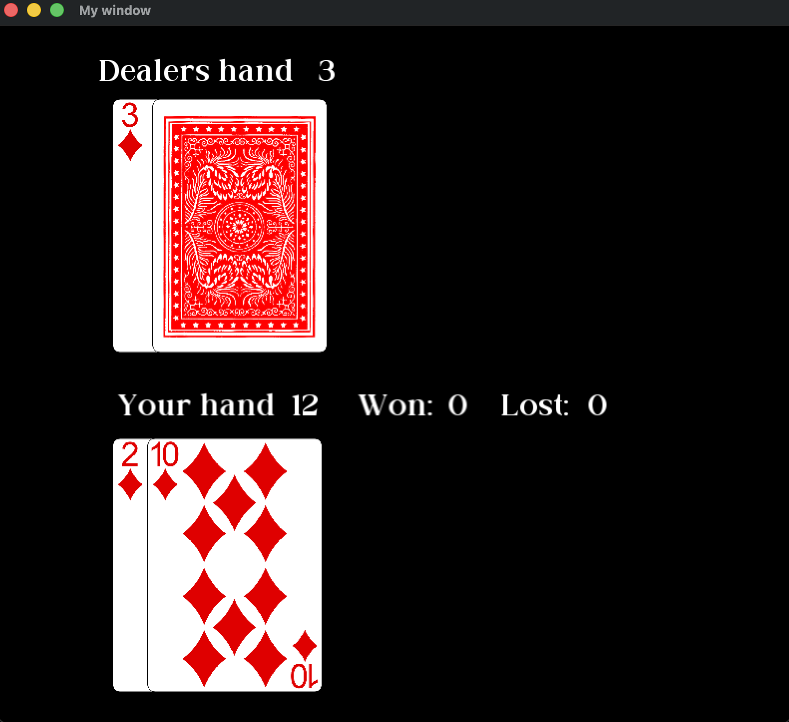

# Blackjack (C++ / SFML 3)

A desktop Blackjack game built in C++ with SFML 3 for rendering, card sprites, and animation.

Originally built as a team project for a CS class; the graphics implementation, texture management, and animation architecture in this repo are my own work, done independently after the course ended.

## Screenshots

## Technical Highlights

- **Texture lifetime management** - tracked down and fixed dangling sprite references caused by textures being destroyed while sprites still held pointers to them.
- **Memory leak fix** - resolved leaks caused by reloading textures from disk on every round reset instead of reusing already-loaded textures.
- **Event-driven architecture** - replaced a blocking input loop with an event-driven design so the game stays responsive instead of freezing while waiting for input.
- **Non-blocking dealer animation** - implemented a clock-based delay between dealer card reveals (instead of blocking calls like `sleep`), so the dealer's turn plays out visibly over time rather than resolving instantly. Includes a hole-card reveal the moment the dealer's turn begins.

## Known Limitations

- A natural blackjack (Ace + 10-value card) on the initial deal doesn't currently trigger an automatic win - it's treated the same as any other hand. Fixing this is the next planned improvement.

## Built With

- C++
- SFML 3.x

## Assets

Card sprites and font located in `Sprites/` and `Fonts/`.
